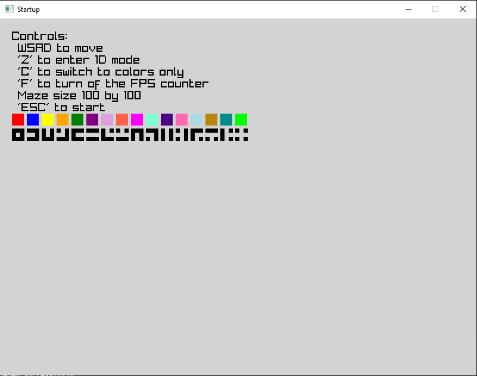
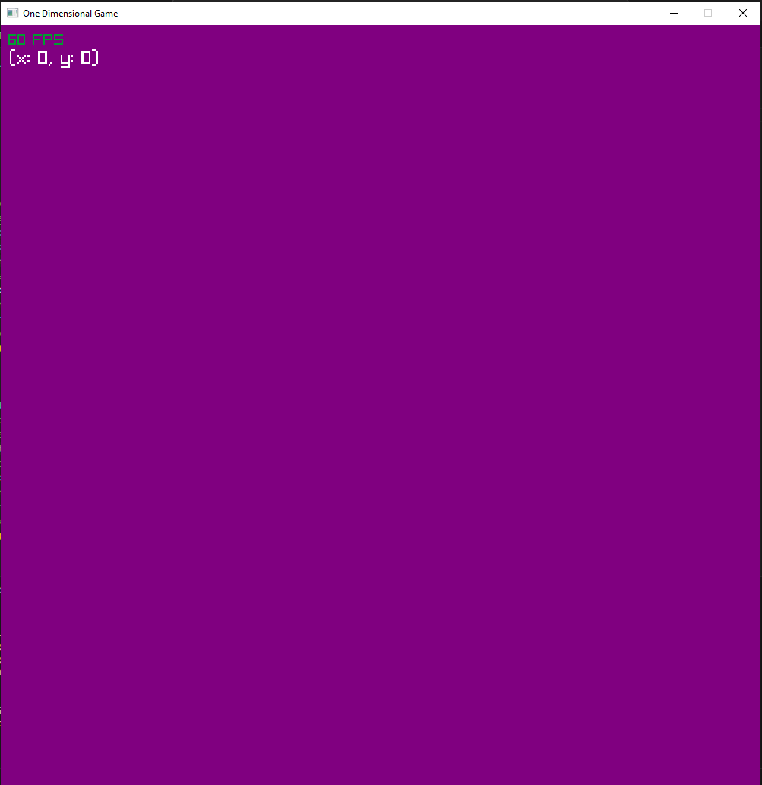
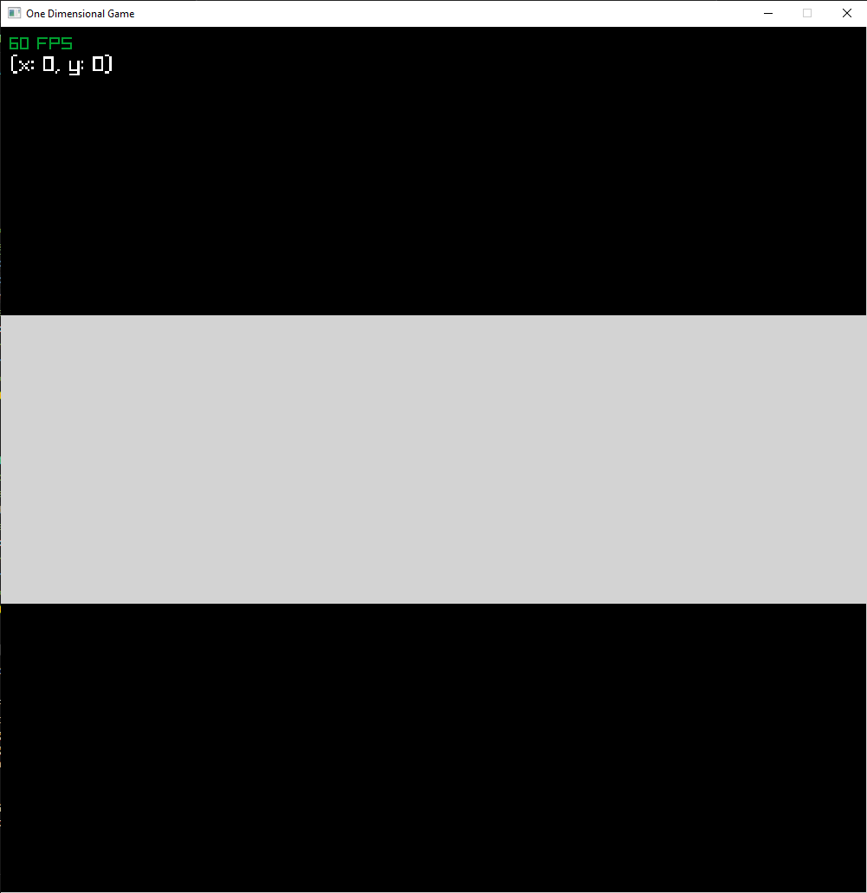
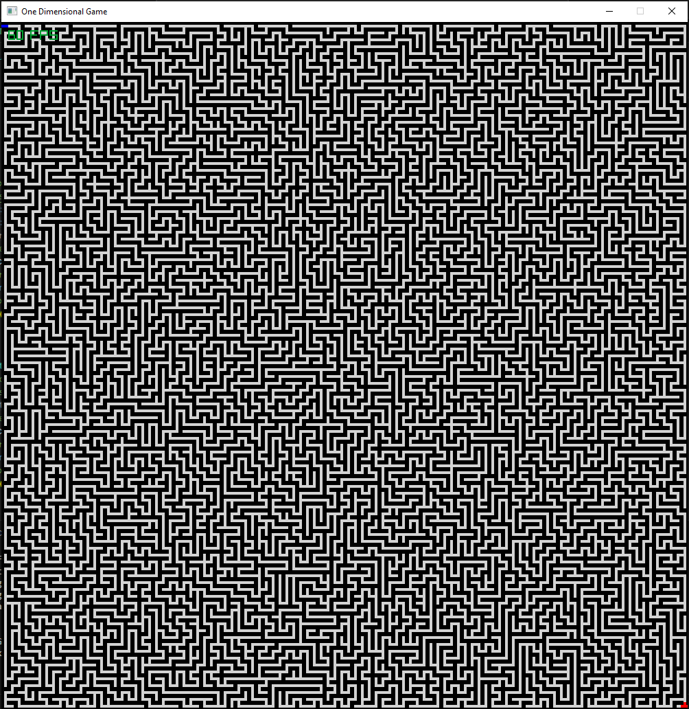
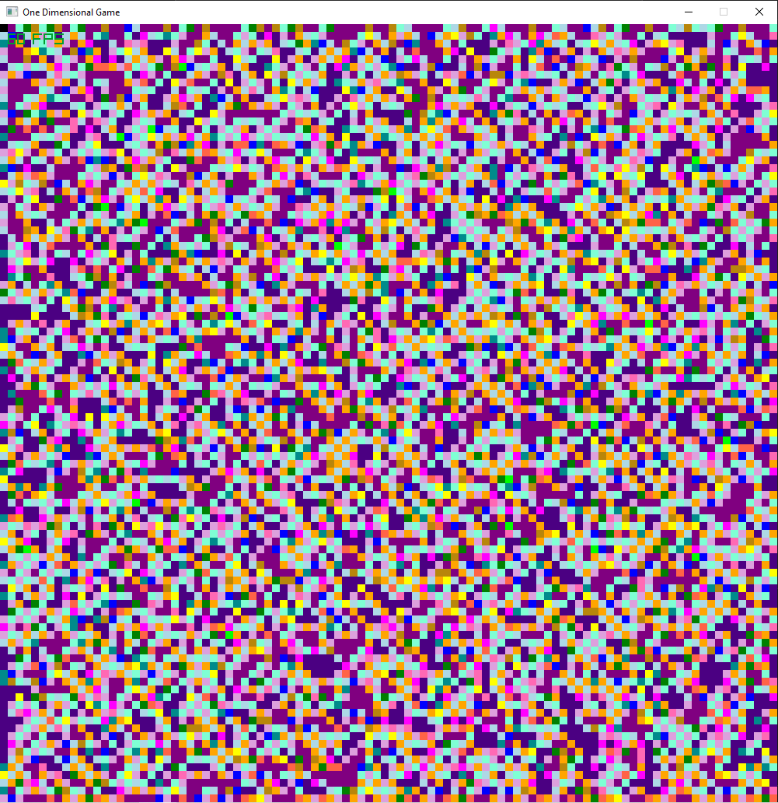

# One Dimension Game
#### by Clayton Ross
This is a maze traversing game where the main concept is you view the maze through a single dimension, in this case color.
## Table of Contents
- [Installation](#installation)
- [Usage](#usage)
- [Configuration](#configuration)
- [Examples](#examples)
- [Contributing](#contributing)
- [License](#license)
## Installation
### Clone and build the repo
```bash
git clone https://github.com/LeadClaymore/OneDGame
cd One_D_Game
cargo build
```
### Dependencies
#### rust specific:
```toml
toml = "0.8.19"
serde = "1.0.136"
serde_derive = "1.0.136"
raylib = "5.0.2"
rand = "0.8"
```
#### other:
```
llvm + clang + gcc + vstools
```
## Usage
```bash
cd One_D_Game
cargo run
```
## Configuration
within config.toml you can change the screen size, and target fps
within the code itself there are colors used within the "color_list" function of MazePiece where you can change the colors from the ones given in raylib
## Examples
#### On start you will see this startup screen with the controls and piece to color translation being used. You can also change the size of the maze using WSAD on this screen


#### The maze will start with a color from the previous list


#### The piece color can turned into an understandable piece with the 'C' key


#### The maze can be unzoomed to show the whole board with the 'Z' key based on what color / piece mode you are on will determine if you see a collection of paths or a collection of colors



#### there is win text when you reach the bottom right

## Contributing
if you truly wish to contribute, fork and make a pull request but to be honest this version of a 1D game I dont see how you could improve much outside of some QOL

## License
if you use this please credit it with the git repo but otherwise go ahead